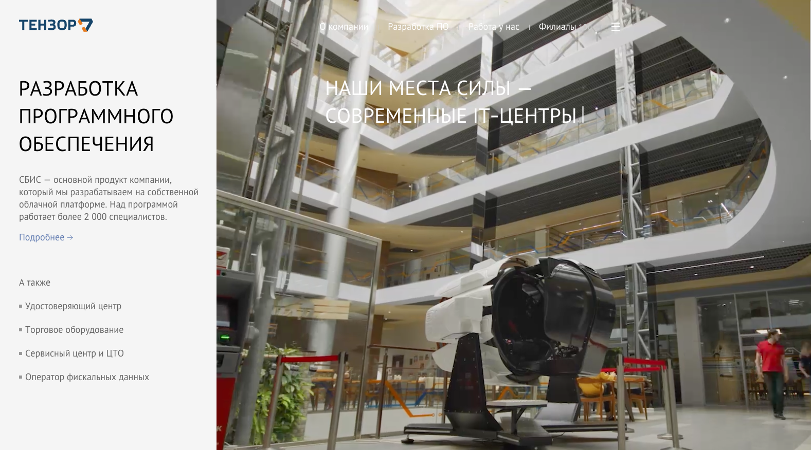
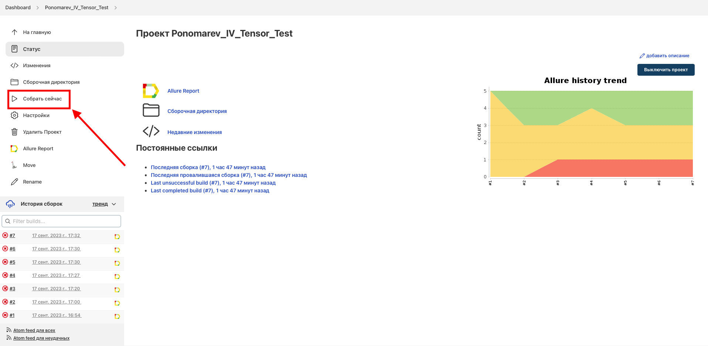
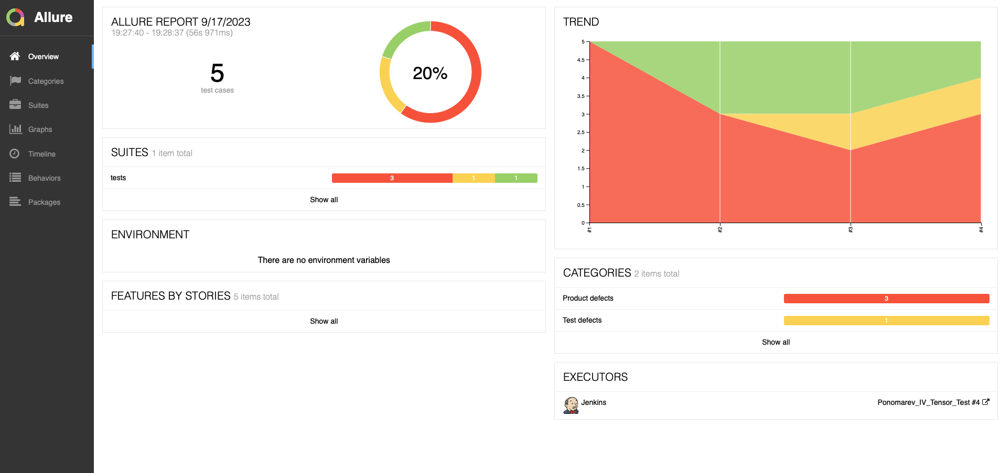
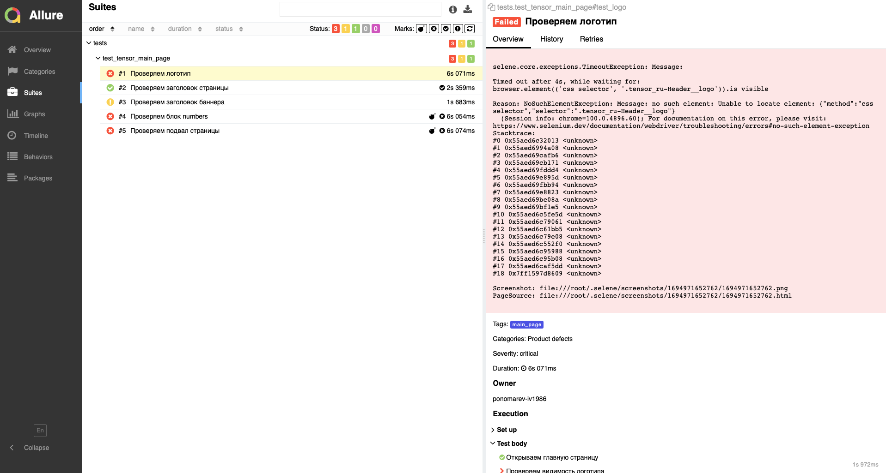
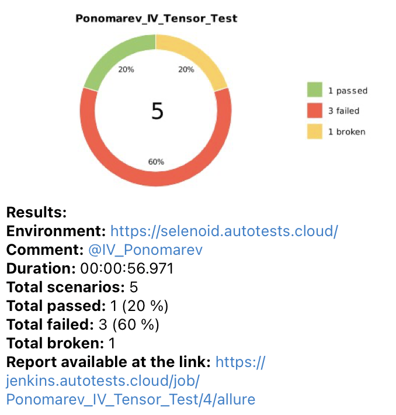
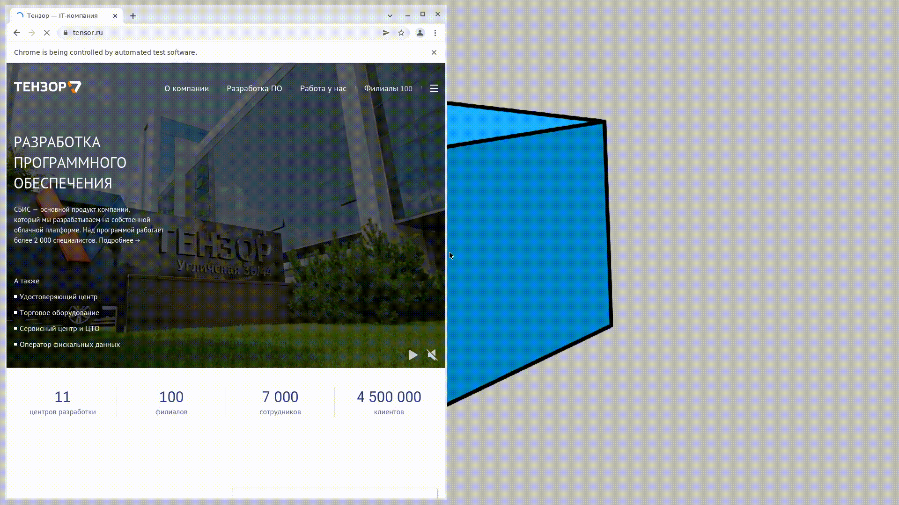

# Демонстрационный проект по тестированию главной страницы сайта компании <a target="_blank" href="https://tensor.ru/">"Тензор"</a>

### Стек технологий:

#### Запуск автотеста производится удаленно на сервере <a target="_blank" href="https://selenoid.autotests.cloud/#/">Selenoid</a> при помощи написанной в Jenkins <a target="_blank" href="https://jenkins.autotests.cloud/job/Ponomarev_IV_Tensor_Test/">джобы</a>.

### Для запуска автотестов необходимо:
- Открыть подготовленную <a target="_blank" href="https://jenkins.autotests.cloud/job/Ponomarev_IV_Tensor_Test/">джобу</a> в Jenkins
- Нажать "Собрать сейчас" в боковом меню

#### *После прохождения автотестов можно зайти в Allure Report и посмотреть отчет по тестовому прогону:*

#### *А так же подробно посмотреть результат прохождения каждого отдельного теста:*

### Для мгновенного получения результатов о тестировании настроено автоматическое оповещение через Telegram.

### Ниже на видео представлен пример короткого теста на сервере <a target="_blank" href="https://selenoid.autotests.cloud/#/">Selenoid</a>.

